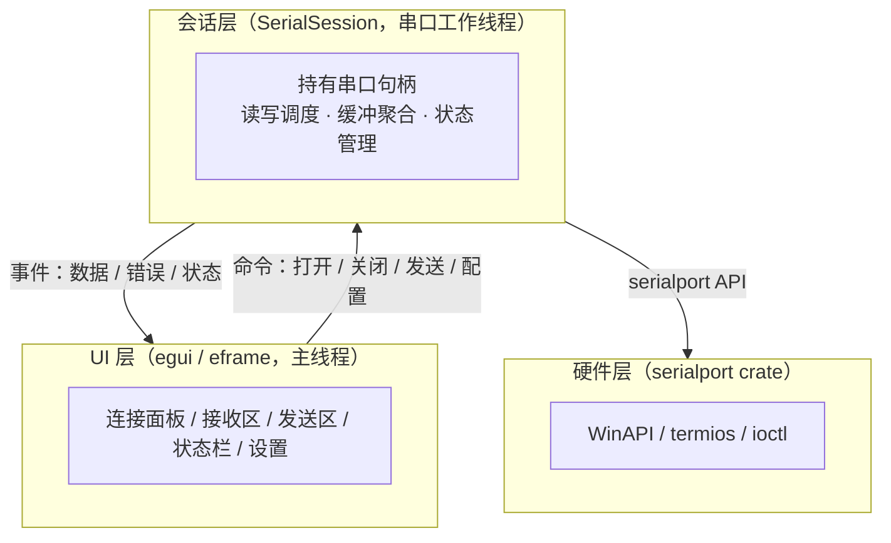
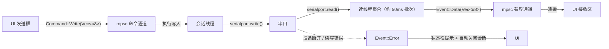
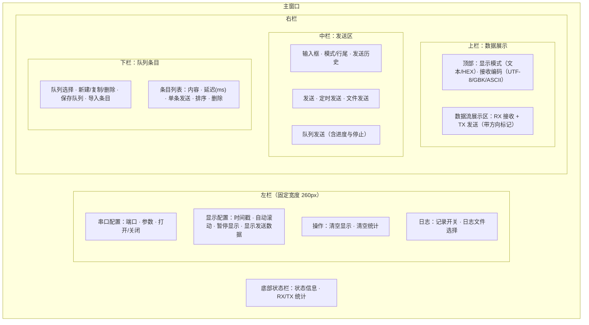

<!-- SPDX-License-Identifier: MIT -->
<!-- Copyright (c) 2026 Joran -->

# 串口调试助手（Serial Tool）设计文档

> 状态：待评审（V1）
> 日期：2026-07-31
> 语言 / 平台：Rust，跨平台（Windows / macOS / Linux）

## 1. 项目概述

使用 Rust 编写一款跨平台串口调试助手，用于串口设备的调试与开发。目标形态：轻量、启动快、单可执行文件分发（V1 不依赖外部运行时）。

核心能力：串口枚举与连接、参数配置、数据收发（文本 / HEX）、时间戳、定时发送、文件发送、日志保存、统计信息、设置持久化。

## 2. 目标与非目标

### V1 目标

- 串口自动枚举与刷新（Windows 的 COM 口、Linux/macOS 的 tty 设备）
- 连接参数配置：波特率、数据位、停止位、校验位、流控
- 数据展示区：接收与发送数据合并显示、文本 / HEX 双模式、时间戳、自动滚动、暂停显示、“显示发送数据”开关
- 发送区：文本 / HEX 输入、行尾选择、发送历史、定时发送
- 发送队列：多条命名队列、按序发送、条目级延迟（毫秒）、单条发送、忽略空条目、队列保存 / 导入（TOML / TXT）
- 发送文件（后台线程分块发送，带进度与取消）
- 日志保存、收发字节统计
- 设置持久化（记住上次的端口参数与 UI 偏好）
- 内置中文字体支持（界面与数据均为中文环境）

### V1 非目标（后续版本考虑）

- 多串口同时调试（V2）
- 协议解析 / 报文模板 / 脚本化（Modbus、自定义帧等，预留扩展点）
- 波形图、虚拟示波器类功能
- 蓝牙 / USB 虚拟串口映射的特殊管理（依赖系统机制）
## 3. 技术选型

| 方面 | 选择 | 说明 |
| --- | --- | --- |
| 语言 | Rust 2021 edition | 内存安全、单二进制分发、跨平台一致 |
| GUI 框架 | **egui / eframe**（推荐） | 见下方对比 |
| 串口访问 | [`serialport`](https://crates.io/crates/serialport) | 跨平台封装：Windows 用 WinAPI，Linux/macOS 用 termios/ioctl，社区事实标准 |
| 线程通信 | `std::sync::mpsc` | 读线程 → UI 的事件通道；UI → 会话的命令通道 |
| 配置持久化 | `serde` + `toml` + [`directories`](https://crates.io/crates/directories) | 人类可读、跨平台标准配置目录 |
| 文本编码 | `encoding_rs` | UTF-8（默认）/ GBK / ASCII 解码 |
| 日志 | `tracing`（可选） | 运行日志落盘，便于排查 |
| 测试 | 单元测试 + socat / com0com 虚拟串口回环 | CI 中验证读写链路 |

### GUI 框架对比

| 框架 | 优点 | 缺点 | 结论 |
| --- | --- | --- | --- |
| **egui/eframe** | 纯 Rust、开发效率高、单二进制、即时模式适合工具类界面 | 默认字体不含中文字形（需内置 CJK 字体）；外观偏工具风 | **推荐** |
| Slint | 声明式 UI、性能好 | GPL/商业双许可需注意；生态较新 | 备选 |
| Iced | 纯 Rust、Elm 架构清晰 | 生态成熟度一般，开发速度偏慢 | 备选 |
| Tauri + Web | 界面现代、字体渲染无痛 | 依赖系统 WebView（WebView2/WebKitGTK），打包体积大，构建链复杂 | 若要求高颜值界面再评估 |

egui 方案下需内置一款 OFL 许可的中文字体（如 Noto Sans SC / 思源黑体子集），体积约几 MB，可接受。

## 4. 总体架构

三层结构，职责分离：



### 线程模型

- **主线程**：eframe 事件循环，渲染 UI、处理用户输入。不做阻塞 IO。
- **读线程**：每个打开的串口一个读线程，以约 50ms 超时阻塞读；数据按批次（约 50ms 聚合）经有界 mpsc 通道发给 UI，避免高波特率下刷爆 UI。
- **写操作**：普通发送数据量小，经命令通道投递到会话线程执行；**发送文件**在后台线程分块读取并写入串口，通过事件回报进度，支持取消。

串口句柄只由会话线程持有，避免并发读写竞态；打开、配置、关闭都通过命令通道串行化。

### 数据流



## 5. 界面设计

### 5.1 布局总览

主窗口分为**左右两栏**：

- **左栏（固定宽度 260px）**：串口参数配置、显示配置（时间戳 / 自动滚动 / 暂停显示 / 显示发送数据）、清空与统计操作、日志记录。
- **右栏（自上而下三栏）**：
  - **上栏：数据展示**——接收与发送数据在同一展示区合并显示；显示模式（文本/HEX）与接收编码选择位于展示区上方。
  - **中栏：发送区**——输入框、模式/行尾、发送历史、发送按钮、定时发送、文件发送、**队列发送按钮**（含进度与停止）。
  - **下栏：队列条目**——队列选择与增删、条目编辑（内容 / 延迟 / 单条发送 / 排序 / 删除）、保存队列、导入条目。
- **底部状态栏**：状态信息、连接状态、RX/TX 统计、周期发送状态。

布局细节：

- **串口配置**为顶部通栏，横向分布并填满窗口宽度：各字段宽度按窗口宽度**相对分配**（随窗口缩放自适应），打开/关闭串口按钮固定大小靠右。
- **数据展示区**：接收与发送数据均固定打印时间戳（`[HH:MM:SS.mmm] [RX]` / `[HH:MM:SS.mmm] [TX]`），不再提供时间戳开关。
- **文件发送区**：占满所在区域宽度，文件名占满剩余宽度（超长截断）；模式下拉框的箭头图标由画笔绘制，不依赖字体字形。
- **队列条目**：图标按钮（上移/下移/复制/删除）统一为方形比例（18×18），点击区域随窗口缩放自适应。
- **对齐与背景**：所有横向排布的控件统一垂直居中；队列操作行按钮与“队列发送”按钮等高（33px）；接收区文本框背景为浅灰、发送区输入框为纯白（二者背景互换）。
- **悬停提示**：端口、参数、显示、日志、发送、文件、队列等主要控件均带鼠标悬停功能说明。



### 5.2 布局层级（5 个主布局）

主布局自上而下包含 **5 个 layout**，每个均横向填满父容器：

1. **布局1（内容横向分布、高度固定 48px、宽度自适应）**：串口配置（端口 / 波特率 / 数据位 / 停止位 / 校验位 / 流控 + 打开/关闭串口按钮，按钮文字垂直居中）。
2. **布局2（内容纵向分布、宽高自适应）**：接收功能。内含 2 个**无边框**子布局：
   - 子1（内容横向分布、高度固定、宽度自适应）：显示模式、编码、自动滚动、暂停接收、自动刷新、显示发送、记录日志、**打开日志路径**（按钮，仅勾选“记录日志”后启用）、清空显示、清空统计。
   - 子2（内容填充、宽高自适应）：接收区——**只读**文本框（不可编辑、浅灰背景符合只读属性）。
3. **布局3（内容纵向分布）**：发送。两个子布局均隐藏边框：
   - 子1（高度固定、宽度自适应）：发送文本框，**可读写**并填充父控件大小。
   - 子2（内容横向分布、高度固定、宽度自适应）：发送、清空发送、添加到队列、模式、行尾、历史、定时发送、间隔，所有控件垂直居中。
4. **布局4（内容横向分布、高度固定、宽度自适应）**：文件发送——发送文件、整块/逐行下拉框、选择文件按钮与文件名。
5. **布局5（内容纵向分布、高度固定、宽度自适应）**：队列。两个子布局：
   - 子1（内容横向分布、高度固定、宽度自适应）：队列（label）、队列选择、删除、复制、新建、导出、导入、清空队列条目、添加队列条目、队列发送。
   - 子2（内容纵向分布、高度固定、宽度自适应）：队列条目列表；每个条目为一个内容横向布局（高度固定、宽度自适应、内容垂直居中）。

窗口较矮时，5 个主布局整体可纵向滚动，保证布局5（队列）始终可达。

布局细节补充：

- 布局1~5 **内边距统一（8px）**，布局之间以分割线分隔。
- 波特率为**可输入的下拉框**（文本框 + 常用波特率下拉：9600 / 19200 / 38400 / 57600 / 115200 / 230400 / 460800 / 921600 / 1M / 2M）。
- 发送按钮行（布局3-子2）除“历史”下拉框外控件宽度固定，**剩余宽度自动分配给历史下拉框**。
- **仅布局5-子2（队列条目）支持纵向滚动**，主布局本身不滚动。
- 接收区文本框支持**横向与纵向自动滚动**。
- 所有下拉框统一为“整块发送”样式：白底描边按钮 + 右侧绘制箭头 + Popup 菜单；文件模式下拉框宽度与“发送文件”按钮一致（102px）。
- 可点击控件（按钮、下拉框、复选框、条目图标按钮）悬停时显示**手型光标**（PointingHand）。
- 文件发送：选择“逐行发送”时，“行间隔”控件紧跟在模式下拉框后面；文件名标签左对齐。
- 波特率下拉框固定宽度 108px（可完整显示 8 个字符）；停止位下拉框加宽以完整显示“1.5”。
- “打开日志路径”、“清空显示”、“清空统计”按钮与“发送”按钮等高（32px）。
- 行尾下拉框选项只显示 “无 / CR / LF / CRLF”（去掉括号说明）；所有横向排布控件保持垂直居中。

## 6. 功能设计

### 6.1 端口与连接

- 枚举：`serialport::available_ports()`，下拉框直接显示 USB 产品名/制造商（如 `USB-SERIAL CH340`），无名称时直接显示端口名（不再追加 `(COMx)` 后缀）。
- 刷新：无手动刷新按钮，默认开启 5 秒自动检测（可在左栏关闭）。
- 打开期间禁用端口切换与参数修改；断开时自动刷新端口列表。
- 参数：
  - 波特率：可输入的下拉框（文本框直接输入，或从常用波特率列表中选择：9600 ~ 2,000,000）
  - 数据位：5 / 6 / 7 / 8
  - 停止位：1 / 1.5 / 2
  - 校验位：None / Even / Odd / Mark / Space
  - 流控：下拉框选择——无流控 / 软流控（XON/XOFF）/ 硬件流控（RTS/CTS）
  - 注：serialport 库不支持 1.5 停止位与 Mark/Space 校验，UI 保留选项，选择后打开串口时会给出明确错误提示（V1 限制，后续可自行实现）。

### 6.2 数据展示（接收 + 发送）

- 接收与发送数据在**同一展示区**合并显示；开启左栏“显示发送数据”后，发送数据以 `[TX]` 标记（开启时间戳时为 `[HH:MM:SS.mmm] [TX]`），接收数据默认无标记（开启时间戳时带 `[HH:MM:SS.mmm]`）。
- 接收区为**只读**文本框（不可编辑、浅灰背景符合只读属性）。
- 显示模式：**文本** / **HEX**（大写、字节间空格），切换只影响显示；显示模式与接收编码选择位于展示区上方。
- 文本解码：默认 UTF-8；提供 GBK、ASCII 选项（`encoding_rs`），解码失败字节以 `�` 或 `\xNN` 显示。
- 时间戳：接收与发送数据均固定打印 `[HH:MM:SS.mmm]` 时间戳（RX 为 `[时间] [RX]`，TX 为 `[时间] [TX]`），不再提供开关。
- 自动滚动 / 暂停显示 / 显示发送数据 / 清空显示 / 清空统计：位于“显示设置”行。
- 暂停显示：暂停仅停止展示区更新，不停止读取、统计与日志写入。
- 日志保存：勾选“记录日志”后自动弹出路径选择；追加写入 `.log` 文本文件，格式与显示一致（含时间戳与方向标记）；“打开日志路径”按钮（勾选后启用）可在系统文件管理器中定位日志文件。
- 统计：累计 RX / TX 字节数，可清零。

### 6.3 发送

- 输入模式：文本 / HEX。
  - HEX 解析规则：忽略空白与逗号；支持 `0x` 前缀（如 `0x01 0x0A`）；连续偶数个十六进制字符视为字节序列（如 `010AFF`）；非法或奇数长度时给出输入错误提示，不发送。
- 行尾：无 / CR / LF / CRLF（文本模式）。
- 发送历史：最近 20 条，下拉选择，可清空。
- 定时发送：间隔可配（单位 ms，≥10ms），启停按钮；状态在状态栏显示。
- 发送队列：发送区内提供**“队列发送”**按钮，通过下拉框选择要发送的队列，按序发送（规则见 6.4）；队列全部条目为空时弹窗警告。
- 发送文件：选择文件，两种模式：
  - 整块发送：后台分块（如 4KB）写入；
  - 逐行发送：按行读取，附加所选行尾，行间可配延时。
  - 显示进度与已发字节数，可中途取消。

### 6.4 发送队列

#### 队列管理

- 支持创建多条**命名队列**（如“上电测试”“心跳包”），每条队列包含若干发送条目。
- 队列列表展示，可新增、重命名、删除、复制队列。
- 条目编辑：添加 / 编辑 / 删除 / 上移 / 下移 / 复制；可整体清空当前队列。
- 条目内容支持**文本 / HEX** 两种模式（复用 6.3 的 HEX 解析规则），非法内容在编辑时即提示。
- 条目发送时统一附加当前发送区的行尾设置，保持行为一致；按条目单独配置行尾列为后续扩展。

#### 队列发送（按序发送）

- 选中某条队列后，点击**“队列发送”**按钮，按条目顺序依次发送全部条目。
- **空条目忽略**：内容为空的条目在队列发送时直接跳过（不发送）；若队列中**全部条目均为空**，弹窗警告“队列中所有条目均为空，无法发送”。
- **条目延迟**：每条目可单独设置延迟（ms，≥0 整数）；队列发送时，发送完该条目后按此延迟等待，再发送下一条，延迟为 0 表示紧接着发送。最后一条发送后不额外等待。
- 发送过程在后台线程执行，UI 实时显示进度（当前第 i / 共 n 条）与剩余条目；可随时点击**“停止发送”**中止。
- 队列发送进行中，禁用定时发送与队列再次触发，防止并发写乱序；发送区编辑不受影响（下一轮生效）。

#### 单条发送

- 每条目右侧提供**“发送”**按钮，点击后仅发送该条目（忽略条目延迟），即时触发。
- 单条发送同样经会话线程写入，与队列发送互斥（队列发送进行中禁用）。

#### 保存与导入

- **保存队列**：将当前队列（名称 + 全部条目，含模式 / 内容 / 延迟）导出为 TOML 文件（`.toml`）。
- **导入条目**：支持 **TOML**（完整队列结构）与 **TXT**（每行一条文本条目，忽略空行）两种格式；导入的条目追加到当前队列，受容量上限约束，超出部分跳过并在状态栏提示。

#### 队列文件格式（调研与决策）

| 格式 | 可读性 | 表达列表 | Rust 生态 | 结论 |
| --- | --- | --- | --- | --- |
| TXT | 好 | 弱（需自定义分隔，多行 / 二进制内容易破坏） | 无标准解析 | 仅作便捷导入 |
| XML | 中（冗长） | 中 | 需额外依赖 | 不采用 |
| INI | 好 | 差（列表需编号键） | 需额外依赖 | 不采用 |
| TOML | 好 | 好（数组表 `[[items]]`） | serde + toml 已引入 | **主格式** |
| JSON | 中 | 好 | 需新增 serde_json | 备选 |

**决策：TOML 作为队列保存 / 导入的主格式**——与程序配置使用同一序列化栈（零新增依赖）、人类可读可手改、天然支持 `[[items]]` 数组表达条目列表；同时提供 TXT 便捷导入（每行一条文本条目），便于快速批量录入。

#### 持久化

- 队列及其条目、条目延迟、当前选中项随配置持久化保存（见 6.5），重启后保留。
- 保存前做容量上限检查（默认每条队列 ≤ 200 条，可配置），防止配置文件失控。

### 6.5 设置持久化

- 保存内容：上次使用的端口参数、窗口大小、数据展示偏好（模式、编码、时间戳、自动滚动、显示发送数据）、发送区偏好（模式、行尾）、布局尺寸（上 / 下栏高度）、日志目录。
- 存储位置（`directories::ProjectDirs`）：
  - Windows：`%APPDATA%\serial-tool\`
  - Linux：`~/.config/serial-tool/`
  - macOS：`~/Library/Application Support/serial-tool/`
- 首次启动使用默认值；配置损坏时自动回退默认并保留备份。

## 7. 错误处理

- 打开失败、配置失败、写入失败：状态栏醒目提示 + 运行日志记录，程序不崩溃。
- 设备拔出：读线程返回错误 → UI 提示并自动关闭会话 → 端口列表刷新。
- 发送框输入非法（HEX 解析失败）：输入框旁红字提示，不发送。
- 日志目录不可写：提示并回退到临时目录。
- 所有 IO 错误均转换为统一错误文本（`Result<_, String>`），UI 层只展示友好信息。

## 8. 目录结构

```
serial-tool/
├── Cargo.toml
├── docs/
│   └── design.md
├── assets/
│   └── fonts/              # 内置中文字体（OFL）
├── src/
│   ├── main.rs             # 入口：初始化日志、加载配置、启动 eframe
│   ├── app.rs              # eframe App：状态聚合、事件消费、面板布局
│   ├── config.rs           # 持久化配置（serde + toml）
│   ├── queue_file.rs       # 队列文件保存 / 导入（TOML / TXT）
│   ├── serial/
│   │   ├── mod.rs
│   │   ├── session.rs      # 会话线程：命令/事件通道、读写调度
│   │   └── config.rs       # 端口参数类型与校验
│   ├── codec/
│   │   ├── mod.rs
│   │   ├── hex.rs          # HEX 解析与格式化
│   │   └── text.rs         # 文本编码转换（UTF-8/GBK/ASCII）
│   └── ui/
│       ├── mod.rs
│       ├── config.rs       # 左栏：串口配置、显示配置、日志
│       ├── data.rs         # 右上栏：数据展示（RX + TX）
│       ├── send.rs         # 右中栏：发送区 + 右下栏：队列条目面板
│       └── statusbar.rs    # 状态栏与统计
└── tests/
    └── loopback.rs         # 虚拟串口回环集成测试
```

## 9. 关键数据结构

```rust
// 端口参数
struct PortSettings {
    port_name: String,
    baud_rate: u32,
    data_bits: DataBits,     // 5/6/7/8
    stop_bits: StopBits,     // 1/1.5/2
    parity: Parity,          // None/Even/Odd/Mark/Space
    flow_control: FlowControl, // None/Software/Hardware
}

// UI → 会话命令
enum Command {
    Open(PortSettings),
    Close,
    Write(Vec<u8>),
    StartPeriodic(u32),      // 周期 ms
    StopPeriodic,
    StartQueueSend { queue_id: usize },
    StopQueueSend,
    SendQueueItem { queue_id: usize, index: usize },
    StartFileSend { path: PathBuf, mode: FileSendMode },
    CancelFileSend,
}

// 会话 → UI 事件
enum Event {
    Data(Vec<u8>),
    Status(ConnectionStatus), // 打开/关闭/波特率等
    Error(SerialError),
    QueueProgress { queue_id: usize, current: usize, total: usize },
    QueueDone { queue_id: usize },
    QueueStopped { queue_id: usize },
    FileProgress { sent: u64, total: u64 },
    FileDone { path: PathBuf, sent: u64 },
}
```

```rust
// 队列数据模型（随配置持久化）
struct SendQueue {
    id: usize,
    name: String,
    items: Vec<QueueItem>,
}

struct QueueItem {
    mode: SendMode,          // Text / Hex
    content: String,
    delay_ms: u32,           // 发送该条目后等待的毫秒数（队列发送时生效，0 = 连续）
}
```

- 队列文件（TOML）与 `SendQueue` 的序列化结构一致；TXT 导入为每行一条文本条目。

## 10. 测试与 CI

- 单元测试：
  - HEX 解析（分隔符、前缀、奇数长度报错、大小写）
  - 文本编码转换（UTF-8 / GBK 边界、非法字节）
  - 端口参数校验（波特率范围、停止位组合）
- 集成测试：
  - Linux CI 使用 `socat` 创建 PTY 对，一个端写、另一端读，验证打开/配置/收发全链路；
  - Windows 本机可选用 com0com 手动验证（CI 不强依赖）。
- CI（GitHub Actions）矩阵：`windows-latest` / `ubuntu-latest` / `macos-latest`，执行 `cargo build` + `cargo test` + `cargo clippy`，产物上传为 Release 附件。

## 11. 打包与发布

- V1 发布形态：各平台 `--release` 单文件二进制（zip / tar.gz）。
- 可选增强（若需要）：Windows 用 NSIS 安装包；Linux 用 AppImage；macOS 用 dmg（需签名流程，默认跳过）。

## 12. 里程碑

| 阶段 | 内容 | 交付物 |
| --- | --- | --- |
| M1 | 工程骨架 | Cargo 工程、eframe 空窗口、内置字体、CI 构建通过 |
| M2 | 串口核心 | serialport 封装、会话线程、命令/事件通道、回环测试通过 |
| M3 | UI 基础 | 两栏布局（左栏配置 + 右栏三栏）、数据展示区（RX/TX、编码、时间戳、自动滚动、暂停） |
| M4 | 发送功能 | 文本/HEX 输入、行尾、历史、定时发送、发送队列（多队列/延迟/单条/空条目忽略/保存导入） |
| M5 | 增强功能 | 文件发送、日志保存、统计、设置持久化 |
| M6 | 打磨发布 | 错误提示、状态栏、打包脚本、README |

每阶段结束可评审后再进入下一阶段。

## 13. 风险与对策

| 风险 | 对策 |
| --- | --- |
| egui 默认字体不含中文 | 内置 OFL 许可的 Noto Sans SC / 思源黑体子集 |
| 串口 crate 的平台差异 | 通过会话层抽象统一接口，平台差异隔离在 session 内 |
| 高波特率（≥1Mbps）刷爆 UI | 50ms 批量聚合 + 有界通道 + UI 每帧限量渲染 |
| 设备热插拔导致句柄失效 | 读线程错误统一转为会话关闭事件，UI 自动刷新 |
| GBK 等非 UTF-8 数据乱码 | encoding_rs 提供多编码解码，HEX 模式兜底 |
| serialport 库不支持 1.5 停止位 / Mark/Space 校验 | 保留 UI 选项，打开时明确报错；后续版本可自行实现串口配置 |

## 14. 评审记录

1. **GUI 框架**：第一版采用 **egui/eframe**，后续再评估是否重构（如 Tauri）。✅
2. **范围**：先实现 V1 全部范围。✅
3. **发布形态**：未明确，默认单文件二进制 + CI Release 产物，后续可再补安装包。⏳
4. **平台优先级**：以 **Windows** 为主要平台，macOS/Linux 保证可编译运行。✅
5. **发送队列间隔**：改为**每条目独立设置延迟（ms）**，队列发送时逐条生效；每条目均支持**单条手动发送**（忽略延迟）。✅
6. **布局调整（2026-07-31）**：改为**左固定栏 + 右栏上（数据展示）/ 中（发送）/ 下（队列条目）三栏**；新增“显示发送数据”开关。✅
7. **队列发送规则（2026-07-31）**：发送时**忽略空条目**；全部条目为空时**弹窗警告**。✅
8. **队列文件格式（2026-07-31）**：调研后采用 **TOML** 为主格式（与配置同栈、可读、支持数组表），并提供 **TXT 便捷导入**。✅
